### Hi there 👋
Check my portfolio website : https://betojava.github.io/

# **Let's get acquainted :**
- 🌱 I am an GenAI engineer at DivinData.

- ⚡ Facts: I like creating video games from scratch: gameplay, musics, graphics, models, etc.

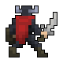 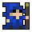 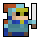 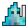 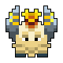 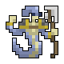 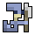 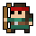 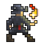
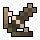 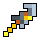 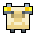 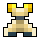 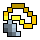 

- 📫 How to reach me: [mail](mailto:jean-baptiste.trognon@divindata.com)

---

---

### :gift: Some of my old work :

  
  
  
  
  
  

---

### :hammer_and_wrench: Languages and Tools :

  
   - **Languages :** 
  
      &nbsp;
      &nbsp;
      &nbsp;
      &nbsp;
      &nbsp;
      &nbsp;
      &nbsp;
      &nbsp;

   - **Frameworks :**      
  
      &nbsp;
      &nbsp;
      &nbsp;
      &nbsp;
  
   - **Databases management :**   
  
       &nbsp;
      &nbsp;
        
  - **Editing :**      
  
      &nbsp;
      &nbsp;
      &nbsp;
      &nbsp;

---

### :fire: My Stats on public repos :

